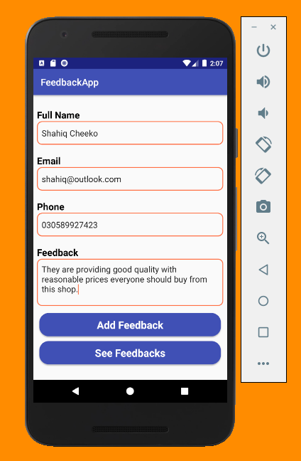
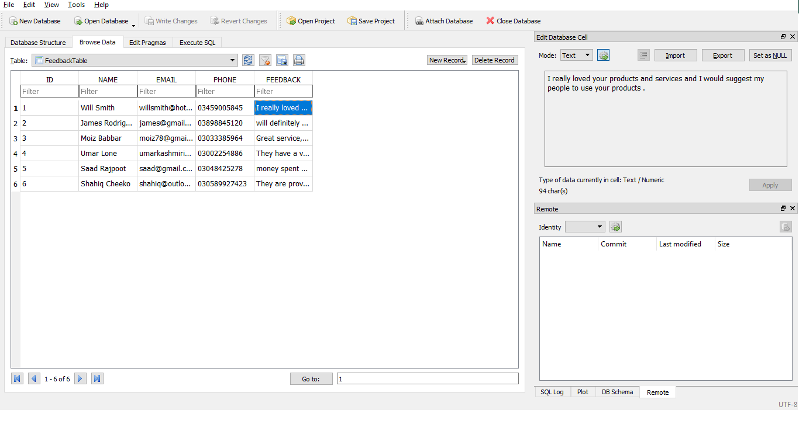

# FeedbackApp
A simple feedback android app made using SQLite.
It takes user's feedback on the main activity and displays all feedback in the recycler view in another activity.
HERE ARE THE SCREENSHOTS,

THIS IS THE DATABASE TABLE IN WHICH THE DATA IS STORED

